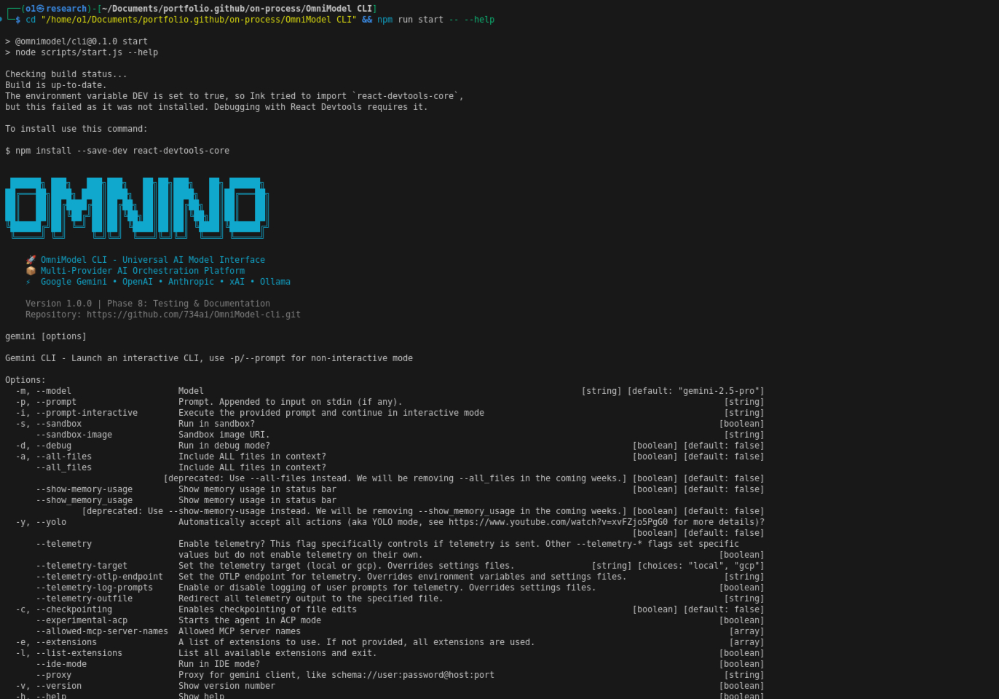

# OmniModel CLI

**One tool to query them all** - A unified command-line interface for multiple AI models including OpenAI GPT, Anthropic Claude, Google Gemini, xAI Grok, and local models via Ollama.



*OmniModel CLI displaying its comprehensive help interface with multi-provider AI support*

## 🚀 Quick Start

### Installation

```bash
npm install -g @omnimodel/cli
```

### Basic Usage

```bash
# Start interactive chat
omniform chat

# Ask a quick question
omniform "What is the capital of France?"

# Use a specific model
omniform --model gpt-4 "Explain quantum computing"

# Work with code
omniform code --file script.py "Add error handling to this function"

# Multi-modal analysis (images, documents)
omniform multimodal --image photo.jpg "What do you see in this image?"
```

## 🎯 Features

- **Multi-Model Support**: OpenAI GPT, Anthropic Claude, Google Gemini, xAI Grok, Ollama
- **Interactive Chat**: Full-featured terminal chat interface
- **Code Analysis**: Intelligent code review and modification
- **Multi-Modal**: Support for images, documents, and mixed content
- **Provider Switching**: Seamlessly switch between AI providers
- **Configuration Management**: Flexible configuration system
- **MCP Integration**: Model Context Protocol support for tool integration

## 📋 Supported Models

| Provider | Models | Features |
|----------|--------|----------|
| **OpenAI** | GPT-4, GPT-4 Turbo, GPT-3.5 | Chat, Code, Vision |
| **Anthropic** | Claude 3.5 Sonnet, Claude 3 Haiku | Chat, Code, Analysis |
| **Google** | Gemini Pro, Gemini Flash | Chat, Vision, Multi-modal |
| **xAI** | Grok | Chat, Real-time data |
| **Ollama** | Llama, Mistral, CodeLlama | Local models |

## ⚙️ Configuration

### First Run Setup

```bash
# Interactive configuration wizard
omniform config setup

# Set API keys
omniform config set openai.api_key YOUR_API_KEY
omniform config set anthropic.api_key YOUR_API_KEY
omniform config set google.api_key YOUR_API_KEY
```

### Configuration File

Configuration is stored at `~/.omniform/config.yml`:

```yaml
providers:
  openai:
    api_key: your-api-key
    default_model: gpt-4
  anthropic:
    api_key: your-api-key
    default_model: claude-3-5-sonnet-20241022
  google:
    api_key: your-api-key
    default_model: gemini-pro

preferences:
  default_provider: openai
  enable_streaming: true
  max_tokens: 4096
```

## 🛠️ Commands

### Chat Commands

```bash
# Interactive chat session
omniform chat

# Quick query
omniform "Your question here"

# Use specific model
omniform --model claude-3-5-sonnet "Your question"

# Continue previous conversation
omniform --continue "Follow-up question"
```

### Code Commands

```bash
# Analyze code file
omniform code --file script.py

# Code review
omniform code --review --file app.js

# Generate code
omniform code --generate "Create a REST API in Node.js"

# Refactor code
omniform code --refactor --file legacy.py "Modernize this code"
```

### Multi-Modal Commands

```bash
# Analyze image
omniform multimodal --image photo.jpg "Describe this image"

# Document analysis
omniform multimodal --file document.pdf "Summarize this document"

# Combined analysis
omniform multimodal --image chart.png --file data.csv "Explain the correlation"
```

### Configuration Commands

```bash
# Show current configuration
omniform config show

# Set configuration values
omniform config set provider.model_name value

# List available models
omniform models list

# Test API connections
omniform config test
```

## 🔧 Advanced Usage

### Model Context Protocol (MCP)

OmniModel CLI supports MCP for extended functionality:

```bash
# List available MCP servers
omniform mcp list

# Connect to MCP server
omniform mcp connect server-name

# Use MCP tools in chat
omniform chat --mcp-tools
```

### Scripting and Automation

```bash
# Batch processing
cat questions.txt | omniform --batch

# JSON output for scripting
omniform --output json "Your question"

# Custom prompts and templates
omniform --template code-review --file app.py
```

## 🏗️ Development

### Building from Source

```bash
git clone https://github.com/734ai/OmniModel-cli.git
cd OmniModel-cli
npm install
npm run build
npm run start
```

### Project Structure

```
OmniModel CLI/
├── packages/
│   ├── cli/          # CLI interface and commands
│   └── core/         # Core functionality and providers
├── scripts/          # Build and development scripts
└── integration-tests/ # Integration tests
```

## 📚 Documentation

- [Configuration Guide](docs/configuration.md)
- [Provider Setup](docs/providers.md)
- [MCP Integration](docs/mcp.md)
- [API Reference](docs/api.md)

## 🤝 Contributing

Contributions are welcome! Please see [CONTRIBUTING.md](CONTRIBUTING.md) for guidelines.

## 📄 License

Apache License 2.0 - see [LICENSE](LICENSE) for details.

## 🆘 Support

- **Issues**: [GitHub Issues](https://github.com/734ai/OmniModel-cli/issues)
- **Discussions**: [GitHub Discussions](https://github.com/734ai/OmniModel-cli/discussions)
- **Documentation**: [Wiki](https://github.com/734ai/OmniModel-cli/wiki)

---

**OmniModel CLI** - Bringing all AI models under one unified interface.
